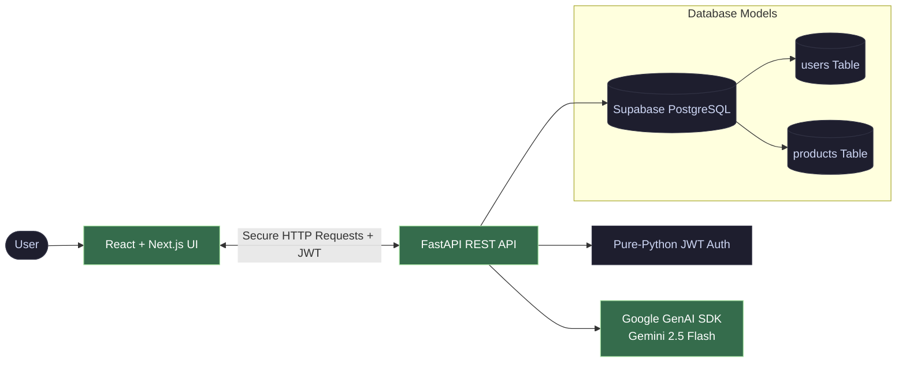

# 🏔️ HimShakti D2C Portal

**An intelligent, multi-tenant administrative portal and AI copywriting optimization engine tailored for local Himalayan food processing units.**

[Explore Docs](#-system-architecture) • [Report Bug](https://github.com/your-username/himshakti/issues) • [Request Feature](https://github.com/your-username/himshakti/issues)

---

## 📌 Overview

**HimShakti** is a specialized production management and marketing acceleration engine designed specifically for local food processing operations in Uttarakhand, India. The application simplifies catalog administration for unique regional inventory assets—such as mountain millets, handmade heritage pickles, and wildcrafted teas—while integrating state-of-the-art Generative AI to automate marketplace optimizations.

### ✦ Core Capabilities

* **🔒 Scoped Multi-Tenancy:** Complete layer isolation across database operations using cryptographic JSON Web Token (JWT) signatures. Users operate in sandboxed instances where product storage maps natively to their identity matrix.
* **🧠 High-Impact Listing Generator:** Direct structural link with the official **Google GenAI SDK (`gemini-2.5-flash`)** to construct high-conversion, keyword-rich Amazon descriptions based on targeted tone frameworks.
* **📐 Viewport-Optimized Copywriting:** The backend prompt rules enforce text outputs strictly between **40–60 words**. This layout architecture guarantees that your descriptions fit cleanly inside dashboard text panels without causing awkward page overflow.
* **🔄 Dynamic Context Pre-Filling:** Replaces static template tools with a live inventory binding menu. Selecting an asset auto-populates metadata coordinates and instantly exposes matching saved copywriting blocks.
* **📊 Live Portfolio Analytics:** Provides real-time calculations monitoring absolute item variance count, unit inventory volume pooling, and dynamic Indian Rupee (₹) net inventory valuation metrics.
* **✏️ Inline Entity Editing:** Interactive data grids that transform classic static product cards into clickable modal entry fields to complete instant category mutations and live stock adjustments.

---

## 🛠️ Tech Stack & Architecture

### Core Infrastructure
* **Backend Interface Layer:** FastAPI ASGI Framework (Python 3.12+)
* **Storage & Relational Mapper:** Supabase Managed Cloud PostgreSQL paired with SQLAlchemy Core
* **Intelligence Pipeline:** Google GenAI SDK Engine (`gemini-2.5-flash`)
* **Security Stack:** URL-Safe Token Encoders, Dynamic SHA-256 HMAC Signatures, HTTPBearer Authentication Middleware

### User Interface Layer
* **Client Architecture:** Next.js 14+ (App Router Deployment, React Client Hydration Hooks)
* **State Protection:** Unified React Hooks `AuthContext` Providers coupled with Route-Level Middleware Interceptors
* **Design Tokens:** Tailwind CSS Engine containing responsive custom dark-mode primitives

---

## 📊 System Architecture

---
