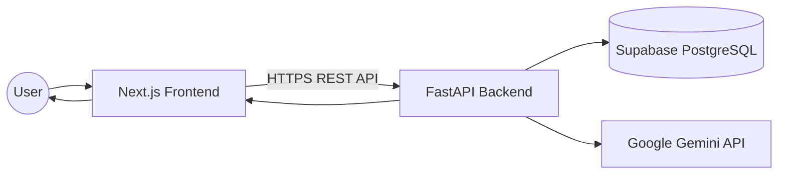
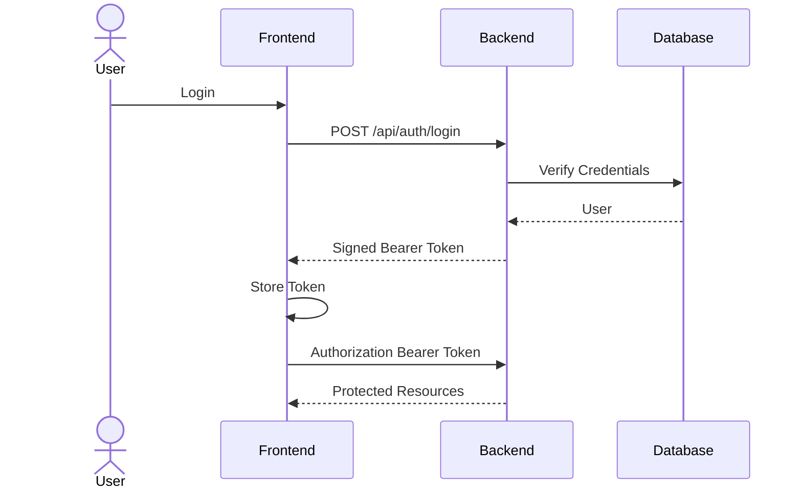
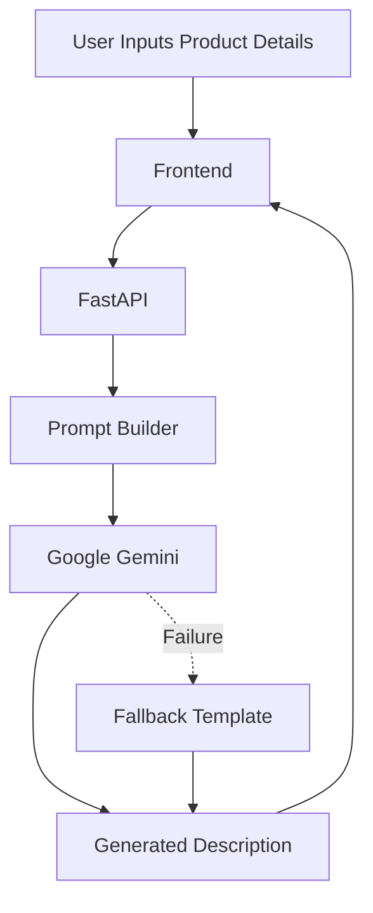

# 🏔️ HimShakti Food Processing
### AI-Assisted Direct-to-Consumer Platform for Rural Food Processing Units

<div align="center">


**An AI-powered full-stack platform enabling rural food producers to manage products and generate professional marketing content using Generative AI.**

---

🌐 **Live Demo:** https://him-shakti-food-processing-rho.vercel.app/

</div>

---

# 📖 Overview

HimShakti Food Processing is an AI-assisted Direct-to-Consumer (D2C) platform developed during the **Technology Business Incubator (TBI-GEU)** Summer Internship.

The project addresses a common challenge faced by rural food processing businesses:

- No centralized product catalogue
- Manual product management
- No professional product descriptions
- No direct digital presence

The platform enables authenticated staff members to manage their product catalogue while generating high-quality, marketing-ready descriptions using **Google Gemini AI**, significantly reducing manual effort.

---

# ✨ Features

## 🔐 Authentication

- Secure Signup/Login
- Password Hashing
- Custom HMAC-SHA256 Bearer Tokens
- Protected Routes
- Rate Limiting
- Session Persistence

---

## 📦 Product Management

- Create Products
- Edit Products
- Delete Products
- Search Products
- Category Filtering
- Individual User Catalogues
- Live Dashboard Statistics

---

## 🤖 AI Description Generator

Generate professional product descriptions using Google Gemini.

Supports multiple marketing tones:

- Premium
- Traditional
- Health Focused

The backend automatically falls back to template-based descriptions if Gemini is unavailable.

---

## 📱 Responsive UI

- Mobile
- Tablet
- Desktop

Designed using Tailwind CSS with reusable UI components.

---

# 🚀 Live Deployment

| Service | URL |
|---------|-----|
| Frontend | https://him-shakti-food-processing-rho.vercel.app/ |
| Backend | https://himshakti-food-processing-ehbo.onrender.com |
| API Docs | https://himshakti-food-processing-ehbo.onrender.com/docs|

---

# 🛠 Tech Stack

| Layer | Technologies |
|--------|--------------|
| Frontend | Next.js (App Router), React, TypeScript |
| Styling | Tailwind CSS |
| Backend | FastAPI, Python |
| ORM | SQLAlchemy |
| Database | PostgreSQL (Supabase) |
| AI | Google Gemini 2.5 Flash |
| Authentication | Custom HMAC-SHA256 Tokens |
| State Management | React Context API |
| Deployment | Vercel + Render + Supabase |

---

# 🏗 System Architecture


```mermaid
flowchart LR

User((User))

Frontend["Next.js Frontend"]

Backend["FastAPI Backend"]

Database[(Supabase PostgreSQL)]

Gemini["Google Gemini API"]

User --> Frontend

Frontend -->|"HTTPS REST API"| Backend

Backend --> Database

Backend --> Gemini

Backend --> Frontend

Frontend --> User
```

---

# 🔐 Authentication Flow


```mermaid
sequenceDiagram

actor User

participant Frontend

participant Backend

participant Database

User->>Frontend: Login

Frontend->>Backend: POST /api/auth/login

Backend->>Database: Verify Credentials

Database-->>Backend: User

Backend-->>Frontend: Signed Bearer Token

Frontend->>Frontend: Store Token

Frontend->>Backend: Authorization Bearer Token

Backend-->>Frontend: Protected Resources
```

---

# 🤖 AI Generation Flow


```mermaid
flowchart TD

A[User Inputs Product Details]

B[Frontend]

C[FastAPI]

D[Prompt Builder]

E[Google Gemini]

F[Generated Description]

G[Fallback Template]

A --> B

B --> C

C --> D

D --> E

E --> F

E -. Failure .-> G

G --> F

F --> B
```

---

# 🗄 Database Schema


```mermaid
erDiagram

USER ||--o{ PRODUCT : owns

USER {

UUID id

string name

string email

string hashed_password

datetime created_at

}

PRODUCT {

UUID id

string name

string ingredients

string weight

string category

json features

string description

float price

int stock

UUID user_id

}
```

---

# 📁 Project Structure

```
HimShakti-Food-Processing

├── frontend
│   ├── app
│   ├── components
│   ├── hooks
│   ├── lib
│   ├── context
│   └── public
│
├── backend
│   ├── routes
│   ├── auth.py
│   ├── database.py
│   ├── db_models.py
│   ├── models.py
│   ├── main.py
│   └── requirements.txt
│
├── README.md
└── prompts.md
```

---

# 📡 API Endpoints

## Authentication

| Method | Endpoint |
|----------|-----------|
| POST | /api/auth/signup |
| POST | /api/auth/login |
| GET | /api/auth/me |

---

## Products

| Method | Endpoint |
|----------|-----------|
| GET | /api/products |
| POST | /api/products |
| GET | /api/products/{id} |
| PUT | /api/products/{id} |
| DELETE | /api/products/{id} |
| GET | /api/products/search/query |

---

## AI

| Method | Endpoint |
|----------|-----------|
| POST | /api/generate |

---

# ⚙ Environment Variables

## Backend

```env
DATABASE_URL=

JWT_SECRET=

GEMINI_API_KEY=
```

## Frontend

```env
NEXT_PUBLIC_API_URL=
```

---

# 🚀 Running Locally

## Clone

```bash
git clone https://github.com/imraumayaggarwal/HimShakti-Food-Processing.git

cd HimShakti-Food-Processing
```

---

## Backend

```bash
cd backend

python -m venv venv

pip install -r requirements.txt

uvicorn main:app --reload
```

---

## Frontend

```bash
cd frontend

npm install

npm run dev
```

# 🧪 Testing

The application was tested through:

- REST API Testing (Postman)
- Authentication Testing
- CRUD Operations
- Security Testing
- Responsive Testing
- AI Generation Testing
- Protected Route Testing

---

# ☁ Deployment

| Component | Provider |
|-----------|----------|
| Frontend | Vercel |
| Backend | Render |
| Database | Supabase |
| AI | Google Gemini |

Continuous Deployment is configured directly from GitHub.

---

# ⚠ Known Limitations (Free Tier)

This project is hosted entirely on free-tier cloud infrastructure.

- Render spins down after approximately **15 minutes** of inactivity.
- The first backend request after inactivity may take **30–60 seconds** while the server wakes up.
- Google Gemini API is subject to free-tier quota limits.
- Supabase free tier has storage and database size limitations.
- Vercel free tier includes bandwidth and execution limits.

---

# 🔮 Future Improvements

- WhatsApp Business Integration
- Analytics Dashboard
- Customer Portal
- AI Nutrition Label Generator
- Payment Gateway Integration

---

# 🙏 Acknowledgements

Developed as part of the **Technology Business Incubator (TBI-GEU)** Summer Internship Program for **HimShakti Food Processing Unit**, with the objective of empowering rural food businesses through modern full-stack web technologies and Generative AI.

---

<div align="center">

⭐ If you found this project interesting, consider giving it a star!

</div>